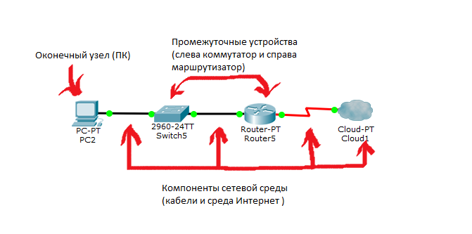
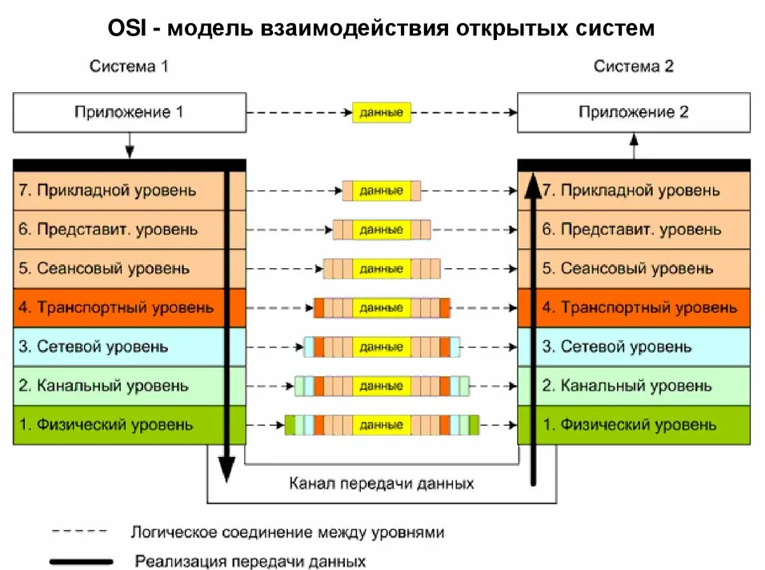

## Основы сетей

### Что такое сеть? 
Сеть - это совокупность устройств и систем, которые подключены друг к другу (логически или физически) и общающихся между собой. 
Сюда можно отнести сервера, компьютеры, телефоны, маршрутизаторы и так далее. 
Размер этой сети может достигать размера Интернета, а может состоять всего из двух устройств, соединенных между собой кабелем. 
В общем выделяется три группы компонентов:

Оконечные узлы: Устройства, которые передают и/или принимают какие-либо данные. Это могут быть компьютеры, телефоны, сервера, какие-то терминалы или тонкие клиенты, телевизоры.

Промежуточные устройства: Это устройства, которые соединяют оконечные узлы между собой. Сюда можно отнести коммутаторы, концентраторы, модемы, маршрутизаторы, точки доступа Wi-Fi.

Сетевые среды: Это те среды, в которых происходит непосредственная передача данных. Сюда относятся кабели, сетевые карточки, различного рода коннекторы, воздушная среда передачи. Если это медный кабель, то передача данных осуществляется при помощи электрических сигналов. У оптоволоконных кабелей, при помощи световых импульсов. Ну и у беспроводных устройств, при помощи радиоволн.

### Для чего мы используем сети (примеры):

1) Приложения: При помощи приложений отправляем разные данные между устройствами, открываем доступ к общим ресурсам. Это могут быть как консольные приложения, так и приложения с графическим интерфейсом.

2) Сетевые ресурсы: Это сетевые принтеры, которыми, к примеру, пользуются в офисе или сетевые камеры, которые просматривает охрана, находясь в удаленно.

3) Хранилище: Используя сервер или рабочую станцию, подключенную к сети, создается хранилище доступное для других. В хранилище хранятся файлы, видео, картинки и открывают общий доступ к ним для других пользователей. 

4) Резервное копирование: Часто, в крупных компаниях, используют центральный сервер, куда все компьютеры копируют важные файлы для резервной копии. Это нужно для последующего восстановления данных, если оригинал удалился или повредился. Методов копирования огромное количество: с предварительным сжатием, кодированием и так далее.

5) VoIP: Телефония, работающая по протоколу IP. Применяется она сейчас повсеместно, так как проще, дешевле традиционной телефонии и с каждым годом вытесняет ее.

### Топология. 
Она делится на 2 большие категории: физическая и логическая. 

Физическая топология — это как наша сеть выглядит. Где находятся узлы, какие сетевые промежуточные устройства используются и где они стоят, какие сетевые кабели используются, как они протянуты и в какой порт воткнуты. 

Логическая топология — это каким путем будут идти пакеты в нашей физической топологии. То есть физическая — это как мы расположили устройства, а логическая — это через какие устройства будут проходить пакеты.

#### Виды топологии:

Топология с общей шиной (англ. Bus Topology)

Кольцевая топология (англ. Ring Topology)

Топология звезда (англ. Star Topology)

Полносвязная топология (англ. Full-Mesh Topology)

Неполносвязная топология (англ. Partial-Mesh Topology)

Смешанная топология (англ. Hybrid Topology)

#### 7 уровневая модель ISO

1) Физический уровень (Physical Layer): определяет метод передачи данных, какая среда используется (передача электрических сигналов, световых импульсов или радиоэфир), уровень напряжения, метод кодирования двоичных сигналов.

2) Канальный уровень (Data Link Layer): он берет на себя задачу адресации в пределах локальной сети, обнаруживает ошибки, проверяет целостность данных. Если слышали про MAC-адреса и протокол «Ethernet», то они располагаются на этом уровне.

3) Сетевой уровень (Network Layer): этот уровень берет на себя объединения участков сети и выбор оптимального пути (т.е. маршрутизация). Каждое сетевое устройство должно иметь уникальный сетевой адрес в сети. На данном уровне работают протоколы IPv4 и IPv6.

4) Транспортный уровень (Transport Layer): Этот уровень берет на себя функцию транспорта. К примеру, когда вы скачиваете файл с Интернета, файл в виде сегментов отправляется на Ваш компьютер. Также здесь вводятся понятия портов, которые нужны для указания назначения к конкретной службе. На этом уровне работают протоколы TCP (с установлением соединения) и UDP (без установления соединения).

5) Сеансовый уровень (Session Layer): Роль этого уровня в установлении, управлении и разрыве соединения между двумя хостами. К примеру, когда открываете страницу на веб-сервере, то Вы не единственный посетитель на нем. И вот для того, чтобы поддерживать сеансы со всеми пользователями, нужен сеансовый уровень.

6) Уровень представления (Presentation Layer): Он структурирует информацию в читабельный вид для прикладного уровня. Например, многие компьютеры используют таблицу кодировки ASCII для вывода текстовой информации или формат jpeg для вывода графического изображения.

7) Прикладной уровень (Application Layer): Наверное, это самый понятный для всех уровень. Как раз на этом уроне работают привычные для нас приложения — e-mail, браузеры по протоколу HTTP, FTP и остальное.

Самое главное - нельзя перескакивать с уровня на уровень (Например, с прикладного на канальный, или с физического на транспортный). Весь путь должен проходить строго с верхнего на нижний и с нижнего на верхний. Такие процессы получили название инкапсуляция (с верхнего на нижний) и деинкапсуляция (с нижнего на верхний). 

На каждом уровне передаваемая информация называется по-разному.

На прикладном, представления и сеансовым уровнях, передаваемая информация обозначается как PDU (Protocol Data Units - блоки данных). 

Информацию транспортного уровня называют сегментами. Хотя понятие сегменты, применимо только для протокола TCP. Для протокола UDP используется понятие — датаграмма. 

На сетевом уровне называют IP пакеты или просто пакеты.

на канальном уровне — кадры.

Ниже приведен пример который взят из статьи "Основы компьютерных сетей. Тема №1. Основные сетевые термины и сетевые модели" который должен помочь в разобраться с процессом инкапсуляции и деинкапусуляции.

